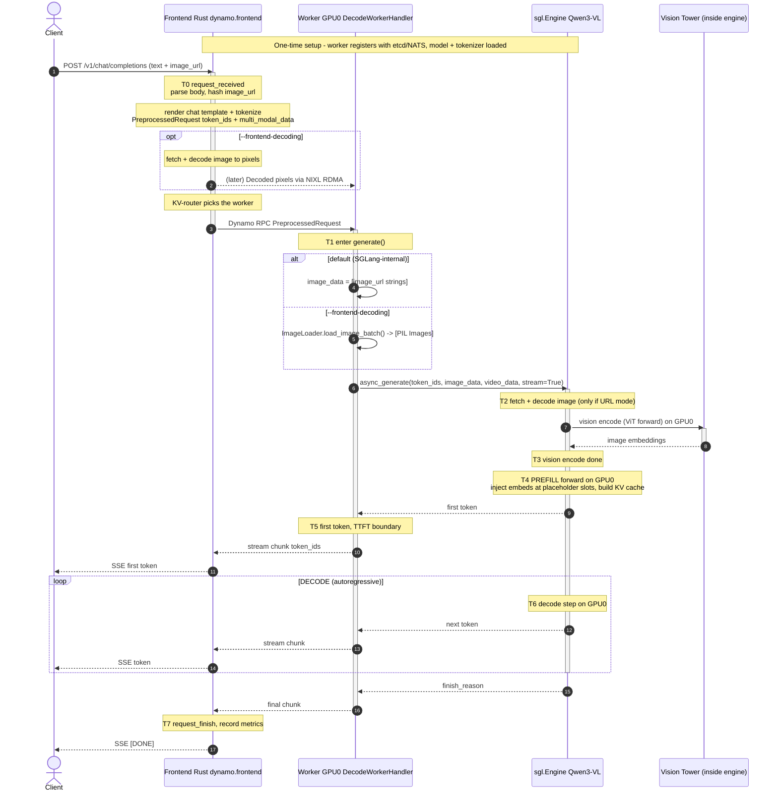

# Dynamo + SGLang Aggregated (E+P+D on 1 GPU) for Qwen3-VL-32B-FP8

This document describes the end-to-end request flow when serving **Qwen3-VL-32B-FP8**
through **Dynamo** with the **SGLang** backend in **aggregated** mode — i.e. **vision
Encode + Prefill + Decode all run in a single `sgl.Engine` on one GPU**.

- **One worker, one GPU.** No encode/prefill/decode split, no inter-worker transfer.
- Vision encoding happens **inside** SGLang's scheduler on the same GPU as the LLM.
- This is the topology produced by
  [`examples/backends/sglang/launch/agg_vision.sh`](../../../examples/backends/sglang/launch/agg_vision.sh).

> Contrast with [E/PD disaggregation](./qwen3-vl-epd-disaggregation.md), where the vision
> encoder runs on a separate GPU and ships embeddings over NIXL/RDMA. Here there is **no
> NIXL embedding handoff** — everything is local to one process and one GPU.

> Model note: `agg_vision.sh` defaults to `Qwen/Qwen3-VL-2B-Instruct`. For
> **Qwen3-VL-32B-FP8** pass `--model-path Qwen/Qwen3-VL-32B-Instruct-FP8`. A 32B FP8 model
> plus KV cache, activations and the vision tower needs a large-memory GPU (e.g. H100/H200
> 80 GB). On a single 24/48 GB card a 32B model will not fit — use the 2B/7B variant or go
> multi-GPU with `--tp`.

---

## 1. Topology

```
                         ┌──────────────────────────────────────────┐
                         │  Frontend (Rust)  dynamo.frontend          │
   HTTP /v1/chat/        │  - OpenAI HTTP server                      │
   completions  ───────► │  - Tokenizer / chat-template render        │
   (image_url + text)    │  - KV-aware router (single worker here)    │
                         │  - (optional) --frontend-decoding:         │
                         │     decode pixels, ship via NIXL RDMA      │
                         └───────────────┬────────────────────────────┘
                                         │  Dynamo RPC (NATS/TCP)
                                         │  PreprocessedRequest
                                         │  {token_ids, multi_modal_data:{image_url:[...]}}
                                         ▼
                         ┌──────────────────────────────────────────┐
            GPU 0        │  Worker (DecodeWorkerHandler, aggregated)  │
        (Qwen3-VL LLM    │  single sgl.Engine                         │
         + vision tower) │  - resolve image_data (URLs or PIL)        │
                         │  ┌──────────────────────────────────────┐ │
                         │  │ sgl.Engine.async_generate()          │ │
                         │  │   1. fetch+decode image (if URL)     │ │
                         │  │   2. VISION ENCODE (ViT)  ──┐        │ │
                         │  │   3. PREFILL (inject embeds)│ same   │ │
                         │  │   4. DECODE loop            │ GPU    │ │
                         │  └─────────────────────────────┘        │ │
                         └───────────────┬────────────────────────────┘
                                         │  streamed token_ids
                                         ▼
                                   Frontend → client
```

Two ways the image bytes reach the engine (selected at launch):

| Mode | Flag | Who fetches/decodes the image | What `image_data` is |
|------|------|-------------------------------|----------------------|
| **SGLang-internal** (default) | *(none)* | SGLang engine fetches the URL and decodes it on the worker | a list of **URL strings** |
| **Frontend-decoding** | `--frontend-decoding` | the **Rust frontend** decodes pixels and ships them to the worker over **NIXL RDMA** | a list of **PIL Images** (`ImageLoader.load_image_batch`) |

In **both** modes the **vision encode (ViT forward) runs inside the SGLang engine on the
same GPU** as prefill/decode. `--frontend-decoding` only moves the *fetch + JPEG/PNG
decode* off the worker; it does not move the ViT.

---

## 2. Sequence Diagram (UML)



---

## 3. Step-by-step walkthrough

### Phase 0 — One-time setup (not per request)
- The single worker registers in the Dynamo distributed runtime (etcd for discovery, NATS
  for RPC transport) and loads the model weights, tokenizer and vision tower onto the GPU.
- With `--frontend-decoding`, the frontend lazily initializes a NIXL connector for shipping
  decoded pixels; otherwise no NIXL is used at all.
- There is **no inter-worker RDMA handshake** in this topology — encode, prefill and decode
  all live in one engine.

### Phase 1 — Frontend (Rust, CPU host)
1. HTTP `POST /v1/chat/completions` arrives with text + `image_url`.
2. The frontend parses the OpenAI body, **hashes the image URL** (for KV/prefix routing),
   renders the chat template, and **tokenizes** — producing a `PreprocessedRequest` with
   `token_ids` and `multi_modal_data = {"image_url": [{"Url": ...}]}`.
   - `agg_vision.sh` uses `--skip-tokenizer-init`, so **the frontend owns tokenization**;
     the worker receives token IDs.
   - If launched with `--frontend-decoding`, the frontend also fetches and decodes the
     image to raw pixels and ships them to the worker via **NIXL RDMA** (as `Decoded`
     items). The model card's `MediaDecoder`, configured at `register_model` time, drives
     this — there is no `--frontend-decoding` flag on the frontend itself.
3. The KV-aware router selects the worker (there is only one) and dispatches over Dynamo RPC.

### Phase 2 — Worker: image resolution (`DecodeWorkerHandler.generate`, aggregated branch)
4. The handler reads `multi_modal_data` and builds `image_data` / `video_data`:
   - **Default**: `image_data = _extract_media_urls(mm_data, "image_url")` — a list of URL
     strings handed straight to SGLang (`decode_handler.py:520`).
   - **`--frontend-decoding`**: `image_data = await self._image_loader.load_image_batch(...)`
     — reads the NIXL-delivered pixels into **PIL Images** (`decode_handler.py:513-518`).
5. The handler calls `engine.async_generate(input_ids=..., image_data=..., video_data=...,
   stream=True)` (`decode_handler.py:528-543`).

### Phase 3 — Single engine: encode → prefill → decode (all on GPU0)
6. **Image fetch/decode** (URL mode only): SGLang's `mm_data_processor` fetches the URL and
   decodes it. (Skipped in `--frontend-decoding` mode — pixels already arrived.)
7. **Vision encode**: SGLang's scheduler runs the **ViT forward pass on the GPU**, producing
   image embeddings. This is internal to SGLang — Dynamo does not expose a separate
   timestamp for it (see §5).
8. **Prefill**: SGLang injects the vision embeddings at the placeholder token positions and
   runs the LLM prefill forward pass, building the KV cache. With radix cache enabled
   (default here — unlike the EPD script, `agg_vision.sh` does **not** pass
   `--disable-radix-cache`), a repeated text/image prefix can be reused.
9. **First token** is emitted (TTFT boundary), then the **decode loop** streams one token
   per step. Tokens flow **Worker → Frontend → client** (no extra hop — the worker is
   directly routable, there is no front-facing encode worker).

---

## 4. Where latency comes from (bottleneck map)

Because everything is on one GPU, vision-encode, prefill and decode **compete for the same
SMs and memory bandwidth**. There is no parallelism between encoding one request and
decoding another the way E/PD disaggregation allows.

| Stage | GPU/host | Typical cost driver | Notes for Qwen3-VL-32B-FP8 |
|-------|----------|---------------------|----------------------------|
| HTTP + tokenize + route | Frontend (CPU) | tokenization; image fetch+decode if `--frontend-decoding` | Small, except remote image **download**. |
| Image fetch + decode | GPU0 worker (URL mode) **or** Frontend (FE-decoding) | remote host latency, JPEG/PNG decode | Moves to the frontend with `--frontend-decoding`. |
| **Vision encode (ViT)** | GPU0 (inside engine) | image resolution → patch count; ViT compute | Runs on the **same** GPU as the LLM, so it **steals cycles from prefill/decode**. |
| **Prefill** | GPU0 | (text + vision tokens) × model size | Vision tokens inflate the prompt → longer prefill. Radix cache can reuse a shared prefix. FP8 weights cut memory BW. |
| **TTFT** | end-to-end | = tokenize + (fetch/decode) + vision encode + prefill + queue | All serialized on one GPU. |
| **Decode (ITL)** | GPU0 | memory bandwidth; batch size; KV size | Shares the GPU with any concurrent request's encode/prefill. |

**The single-GPU-specific bottleneck to scrutinize first:**
- **Head-of-line contention.** A large image's vision-encode + a long prefill will block the
  decode steps of other in-flight requests on the same GPU, inflating their ITL. This is the
  exact problem E/PD disaggregation is designed to remove. If you see ITL spikes that
  correlate with new multimodal requests arriving, this is why.

Other things that can dominate:
- **Queueing**: at `--max-running-requests` capacity, requests wait. The gap between arrival
  and first token includes queue time.
- **Image download**: a slow `image_url` host shows up inside fetch/decode (on the worker in
  URL mode, or on the frontend with `--frontend-decoding`).
- **High-resolution images**: more patches → more vision tokens → longer encode *and* longer
  prefill, both on the one GPU.

---

## 5. Key timestamps & log markers to check

> Important difference from the EPD doc: the aggregated path runs through
> `DecodeWorkerHandler`, which is **not instrumented with the `mm:enc:*` / `mm:pd:*` NVTX
> ranges**. There is **no Dynamo-level timestamp isolating vision-encode** here — it is
> folded inside SGLang's prefill/TTFT. To see encode-vs-prefill breakdown you must use
> SGLang's own scheduler metrics / profiler.

### 5.1 Frontend metrics (Prometheus, scrape the frontend)
Source: `lib/llm/src/http/service/metrics.rs`.

| Metric | Meaning | Use it to see |
|--------|---------|---------------|
| `frontend_service_time_to_first_token_seconds` | **TTFT** histogram (per model) | total time to first token = tokenize + fetch/decode + vision encode + prefill + queue |
| `frontend_service_inter_token_latency_seconds` | **ITL** histogram | decode speed; watch for spikes from on-GPU encode contention |
| `frontend_service_request_duration_seconds` | end-to-end request latency | total wall clock |
| `frontend_service_input_sequence_length_tokens` | ISL (incl. vision tokens) | how much vision inflated the prompt |
| `frontend_service_output_sequence_length_tokens` | OSL | decode length |
| `frontend_service_cached_tokens` | prefix-cache hits | radix cache reuse (enabled by default here) |
| `frontend_service_worker_last_time_to_first_token_seconds{worker_id,...}` | per-worker TTFT gauge | the single worker's TTFT |
| `frontend_service_tokenizer_latency_ms` | tokenize/detokenize cost | frontend CPU cost |

TTFT/ITL bucket ranges are tunable via `DYN_METRICS_TTFT_{MIN,MAX,COUNT}`,
`DYN_METRICS_ITL_{MIN,MAX,COUNT}`, etc.

### 5.2 Frontend request span (logs)
Each request emits an `http-request` span (target `request_span`,
`lib/runtime/src/logging.rs`). Grep the frontend log by `request_id`:

- `request_id`, `trace_id`, `x_request_id` — correlate across components
- `model`, `input_tokens`, `output_tokens`
- **`ttft_ms`** — time to first token
- **`avg_itl_ms`** — average inter-token latency
- `prefill_worker_id`, `decode_worker_id` — **the same worker id** in aggregated mode

On response, the service also logs `status` and `latency_ms` (end-to-end HTTP latency,
`service_v2.rs`). Internal breakdown is computed by `RequestTracker`
(`lib/llm/src/protocols/common/timing.rs`): `request_received` (**T0**),
`first_token_time` (**T5**), `request_finish_time` (**T7**) → `ttft_ms()`,
`avg_itl_ms()`. The disaggregation-only markers (`prefill_complete_time`,
`kv_transfer_estimated_latency_secs()`) are **not relevant** here.

### 5.3 Worker DEBUG log lines (`DecodeWorkerHandler`)
Set the worker log level to DEBUG:
- `New Request ID: <id>` — request entered the handler (`decode_handler.py:430`).
- Handler init line: `... handler initialized` with `mode = "frontend-decoded"` vs
  `"standard"` — confirms which image-ingestion path is active
  (`decode_handler.py:198`).
- `Request <id> will use LoRA adapter: ...` — only if a LoRA is attached.

### 5.4 SGLang engine metrics (the place to see encode vs prefill)
Because Dynamo folds vision-encode into the engine, use SGLang's own metrics/logging to
separate it:
- Run with `--enable-metrics` (already set in `agg_vision.sh`) and scrape the **worker's**
  metrics port (default `DYN_SYSTEM_PORT=8081`). SGLang publishes scheduler stats
  (queue length, running requests, prefill vs decode batch composition, cache hit rate).
- For a precise per-kernel timeline (ViT vs LLM prefill vs decode), capture the worker with
  **Nsight Systems** (`nsys profile`). This is the only way to directly measure
  vision-encode time in the aggregated topology.
- Optional OpenTelemetry tracing: launch with `--enable-otel` to emit spans to an OTLP
  endpoint (sets `--enable-trace --otlp-traces-endpoint`).

### 5.5 How to decompose end-to-end latency
For one request, with `request_id` in hand:

```
end_to_end (request_duration_seconds / latency_ms)
├── frontend: tokenizer_latency + routing            (frontend span / tokenizer metric)
│   └── (+ image fetch/decode if --frontend-decoding)
├── TTFT (ttft_ms)                                    ← the big one for multimodal
│   ├── image fetch+decode (URL mode)                 (visible only in SGLang/nsys)
│   ├── vision encode (ViT)                           (folded into prefill; SGLang/nsys only)
│   ├── queue                                         (SGLang scheduler metrics)
│   └── prefill                                       (SGLang/nsys)
└── decode: avg_itl_ms × (OSL-1)                       (T6 loop, GPU0)
```

If TTFT is high, you must profile the worker (SGLang metrics or `nsys`) to attribute it to
image fetch vs vision encode vs prefill — Dynamo's frontend metrics alone cannot split
those on this path. If ITL is high or spiky, suspect on-GPU contention between decode and
incoming requests' encode/prefill.

---

## 6. Launch reference (aggregated, 1 GPU)

```bash
# Frontend (HTTP + tokenizer + router)
python3 -m dynamo.frontend            # serves :8000

# Single worker on GPU 0: vision encode + prefill + decode in one sgl.Engine
DYN_SYSTEM_PORT=8081 python3 -m dynamo.sglang \
  --model-path Qwen/Qwen3-VL-32B-Instruct-FP8 \
  --served-model-name Qwen/Qwen3-VL-32B-Instruct-FP8 \
  --page-size 16 \
  --tp 1 \
  --trust-remote-code \
  --skip-tokenizer-init \
  --enable-metrics
```

The simplest path is the helper script:

```bash
# Default: SGLang fetches + decodes images on the worker
examples/backends/sglang/launch/agg_vision.sh \
  --model-path Qwen/Qwen3-VL-32B-Instruct-FP8

# Or: decode images in the Rust frontend and ship pixels via NIXL RDMA
examples/backends/sglang/launch/agg_vision.sh \
  --model-path Qwen/Qwen3-VL-32B-Instruct-FP8 --frontend-decoding
```

Notes:
- `--frontend-decoding` moves image fetch + decode off the worker (onto the frontend, over
  NIXL RDMA) but **not** the ViT vision encode, which always runs in the engine.
- `agg_vision.sh` does **not** disable the radix cache, so prefix-cache reuse is available
  (`frontend_service_cached_tokens` can be non-zero).
- For a 32B model that doesn't fit on one GPU, increase `--tp` (tensor parallel across
  multiple GPUs) — still a single aggregated worker, just sharded.

---

## Appendix — When to pick aggregated vs E/PD disaggregation

| | Aggregated (this doc) | E/PD disaggregation |
|---|---|---|
| GPUs | 1 (or 1 worker with `--tp N`) | 2+ (encoder separate from PD) |
| Vision encode location | same GPU as LLM | dedicated GPU |
| Inter-worker transfer | none | embeddings over NIXL/RDMA |
| Strength | simplest; best when image load is light or traffic is low | isolates vision-encode so it can't stall decode; scale encoders independently |
| Weakness | encode/prefill contend with decode on one GPU (ITL spikes) | extra hop + RDMA setup; more moving parts |
| Per-stage Dynamo timestamps | none for vision encode (folded into prefill) | `mm:enc:*` / `mm:pd:*` NVTX ranges expose each stage |

See [`qwen3-vl-epd-disaggregation.md`](./qwen3-vl-epd-disaggregation.md) for the
disaggregated counterpart and its NVTX-based per-stage timing.
