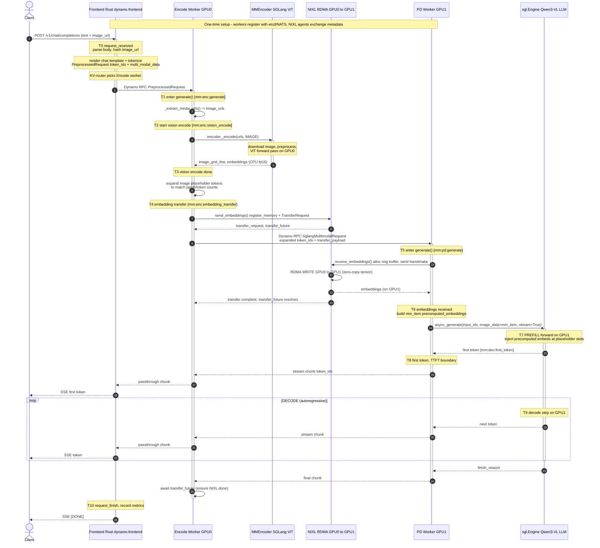

# Dynamo + SGLang E/PD Disaggregation for Qwen3-VL-32B-FP8

This document describes the end-to-end request flow when serving **Qwen3-VL-32B-FP8**
through **Dynamo** with the **SGLang** backend in **E/PD disaggregation**:

- **E (Encode)** worker — the vision encoder — on **GPU 0**
- **PD (Prefill + Decode)** worker — the language model — on **GPU 1**
- **RDMA** (via **NIXL**) used to move the image/video embeddings from E → PD.

This is the topology produced by
[`examples/backends/sglang/launch/multimodal_epd.sh`](../../../examples/backends/sglang/launch/multimodal_epd.sh).
In this topology the PD worker runs **aggregated** (prefill and decode in the same
SGLang engine on the same GPU). The "disaggregation" here is between **vision encode**
and **prefill+decode**, not between prefill and decode. (If you also split P and D, see
[Appendix B](#appendix-b--full-epd-split-encode--prefill--decode).)

> Model note: the launch script defaults to `Qwen2.5-VL`; for Qwen3-VL-32B-FP8 pass
> `--model Qwen/Qwen3-VL-32B-Instruct-FP8` (or your local path) and the matching
> `--chat-template qwen3-vl`. The architecture, handoff, and timing markers below are
> identical regardless of the specific Qwen-VL revision.

---

## 1. Topology

```
                         ┌──────────────────────────────────────┐
                         │  Frontend (Rust)  dynamo.frontend      │
   HTTP /v1/chat/        │  - OpenAI HTTP server                  │
   completions  ───────► │  - Tokenizer / chat-template render    │
   (image_url + text)    │  - KV-aware router                     │
                         └───────────────┬────────────────────────┘
                                         │  Dynamo RPC (NATS/TCP)
                                         │  PreprocessedRequest
                                         │  {token_ids, multi_modal_data:{image_url:[...]}}
                                         ▼
                         ┌──────────────────────────────────────┐
            GPU 0        │  ENCODE worker (E)                     │
       (vision encoder)  │  MultimodalEncodeWorkerHandler         │
                         │  engine = None;  MMEncoder (SGLang)    │
                         │  - download + preprocess image         │
                         │  - ViT forward → embeddings (CPU fp16) │
                         │  - expand placeholder tokens           │
                         │  - NIXL register + send_embeddings()   │
                         └───────────────┬────────────────────────┘
                                         │  (a) Dynamo RPC: SglangMultimodalRequest
                                         │      {token_ids(expanded), transfer_payload}
                                         │  (b) NIXL/RDMA WRITE of embedding tensor
                                         ▼   GPU0 mem ──RDMA──► GPU1 mem
                         ┌──────────────────────────────────────┐
            GPU 1        │  PD worker (Prefill + Decode)          │
        (Qwen3-VL LLM)   │  MultimodalWorkerHandler (aggregated)  │
                         │  sgl.Engine + EmbeddingsProcessor      │
                         │  - receive_embeddings() via NIXL       │
                         │  - inject precomputed_embeddings       │
                         │  - prefill forward (LLM)               │
                         │  - decode loop → stream tokens         │
                         └───────────────┬────────────────────────┘
                                         │  streamed token_ids
                                         ▼
                              back through Encode worker
                              (passthrough) → Frontend → client
```

Key fact about the response path: the **Encode worker is front-facing**. The frontend
routes the request to the Encode worker, which forwards to the PD worker via
`pd_worker_client.round_robin(...)` and **streams the PD worker's tokens back through
itself** to the frontend (see `encode_worker_handler.py:517-537`). So tokens flow
PD → Encode → Frontend → client.

---

## 2. Sequence Diagram (UML)



---

## 3. Step-by-step walkthrough

### Phase 0 — One-time setup (not per request)
- All workers register in the Dynamo distributed runtime (etcd for discovery, NATS for
  RPC transport).
- NIXL agents are created on both the Encode worker (`NixlWriteEmbeddingSender`) and the
  PD worker (`NixlWriteEmbeddingReceiver`) and exchange agent metadata. The receiver
  pre-allocates a registered **ring buffer** (default 8 GB) so RDMA writes land in
  pinned, NIXL-registered memory.
- RDMA connections between GPU0 and GPU1 are established lazily on first transfer and
  then reused. **First request pays a one-time handshake cost; steady-state requests do
  not.**

### Phase 1 — Frontend (Rust, CPU host)
1. HTTP `POST /v1/chat/completions` arrives with text + `image_url`.
2. The frontend parses the OpenAI body, **hashes the image URL** (for KV/prefix routing),
   renders the chat template, and **tokenizes** — producing a `PreprocessedRequest` with
   `token_ids` and `multi_modal_data = {"image_url": [{"Url": ...}]}`.
   - Because the launch uses `--skip-tokenizer-init` on the workers, **the frontend owns
     tokenization**; workers receive token IDs, not raw text.
   - `--frontend-decoding` must be **off** for EPD: the Encode worker needs the URL to run
     vision encoding (`encode_worker_handler.py:316-322`).
3. The KV-aware router selects the (front-facing) Encode worker and dispatches the request
   over Dynamo RPC.

### Phase 2 — Encode worker (GPU0)
4. `MultimodalEncodeWorkerHandler.generate()` extracts image/video URLs.
5. **Vision encode**: `MMEncoder._encode(urls, Modality.IMAGE)` downloads + preprocesses
   the image and runs the **ViT forward pass on GPU0**, returning `image_grid_thw` and an
   embeddings tensor (on **CPU, fp16**). An optional CPU LRU embedding cache
   (`--multimodal-embedding-cache-capacity-gb`) can skip re-encoding identical images.
6. **Token expansion**: each single image placeholder token in `token_ids` is expanded to
   `num_mm_tokens` copies so the count matches the number of vision patches/embeddings.
7. **Embedding transfer setup**: `send_embeddings()` registers the embedding tensor with
   NIXL and returns a `TransferRequest` (sender agent id, tensor id, size, shape, dtype)
   plus a `transfer_future`. The `TransferRequest` is attached as `request.transfer_payload`.
8. The Encode worker forwards `SglangMultimodalRequest` (expanded `token_ids` +
   `transfer_payload`) to the PD worker via `round_robin(...)`.

### Phase 3 — RDMA embedding transfer (GPU0 → GPU1)
9. The PD worker's `EmbeddingsProcessor.process_embeddings()` calls
   `receive_embeddings(transfer_request)`. The receiver allocates a slice of its ring
   buffer and sends a **handshake notification** back to the sender with the target buffer
   address.
10. On receiving the handshake, the sender issues a NIXL **RDMA WRITE** of the embedding
    tensor directly into the PD worker's GPU memory (zero-copy, minimal CPU). Both sides
    poll for completion; the sender's `transfer_future` resolves when done.

### Phase 4 — PD worker prefill + decode (GPU1)
11. The PD worker (`MultimodalWorkerHandler`, **aggregated** mode here) builds an SGLang
    `mm_item` with `precomputed_embeddings` (cast to fp16) and calls
    `engine.async_generate(input_ids=..., image_data=mm_item, stream=True)`.
12. **Prefill**: SGLang injects the precomputed vision embeddings at the placeholder token
    positions and runs the LLM prefill forward pass on GPU1, building the KV cache. With
    `--disable-radix-cache` (set in the EPD launch script), prefix-cache reuse is off, so
    every prefill is full.
13. **First token** is emitted (this is the TTFT boundary), then the **decode loop** runs
    autoregressively, streaming one token per step.
14. Tokens stream **PD → Encode worker → Frontend → client** (the Encode worker is a
    passthrough on the response path). After the stream ends, the Encode worker awaits
    `transfer_future` to confirm the NIXL transfer fully completed.

---

## 4. Where latency comes from (bottleneck map)

| Stage | GPU/host | Typical cost driver | Notes for Qwen3-VL-32B-FP8 |
|-------|----------|---------------------|----------------------------|
| HTTP + tokenize + route | Frontend (CPU) | image-URL fetch if frontend touches it, tokenization | Usually small; watch image **download** latency. |
| **Vision encode (ViT)** | GPU0 | image resolution → patch count; ViT compute | **Often the dominant E-side cost.** High-res images → many patches → more tokens to encode *and* longer prefill. |
| **Embedding transfer (NIXL/RDMA)** | GPU0→GPU1 | tensor size = num_patches × hidden × 2B (fp16) | First request pays RDMA handshake; steady-state is bandwidth-bound and usually small. |
| **Prefill** | GPU1 | (text tokens + vision tokens) × model size | Qwen3-VL-32B is large; vision tokens inflate prefill length. FP8 weights reduce memory BW. `--disable-radix-cache` means no prefix reuse. |
| **TTFT** | end-to-end | = tokenize + encode + transfer + prefill + queueing | The user-perceived "first token" time. |
| **Decode (ITL)** | GPU1 | memory bandwidth; batch size; KV size | Per-token latency; FP8 KV/weights help. |
| Response passthrough | E + FE | extra hop through Encode worker | One extra RPC hop vs. a non-EPD setup. |

**The two EPD-specific bottlenecks to scrutinize first:**
1. **Vision encode on GPU0** — scales with image resolution/patch count. If GPU0 is
   saturated, every multimodal request stalls here. Mitigations: enable the embedding
   cache, lower image resolution, scale out Encode workers.
2. **Prefill length inflation on GPU1** — vision tokens are added to the prompt, so
   prefill is longer than a text-only request of the same text length. This drives TTFT.

Other things that can dominate:
- **Queueing**: if either worker is at `--max-running-requests`, requests wait. The gap
  between request arrival and first-token includes queue time.
- **First-request RDMA handshake**: a cold NIXL connection adds a one-time cost — don't
  benchmark with a single request.
- **Image download**: if `image_url` points to a slow remote host, that latency appears
  inside the vision-encode stage (the encoder fetches the image).

---

## 5. Key timestamps & log markers to check

### 5.1 Frontend metrics (Prometheus, scrape the frontend)
These give you the macro view. Source: `lib/llm/src/http/service/metrics.rs`.

| Metric | Meaning | Use it to see |
|--------|---------|---------------|
| `frontend_service_time_to_first_token_seconds` | **TTFT** histogram (per model) | total time to first token = encode + transfer + prefill + queue |
| `frontend_service_inter_token_latency_seconds` | **ITL** histogram | decode speed (per output token) |
| `frontend_service_request_duration_seconds` | end-to-end request latency | total wall clock |
| `frontend_service_input_sequence_length_tokens` | ISL (incl. expanded vision tokens) | how much vision inflated the prompt |
| `frontend_service_output_sequence_length_tokens` | OSL | decode length |
| `frontend_service_cached_tokens` | prefix-cache hits | will be ~0 with `--disable-radix-cache` |
| `frontend_service_worker_last_time_to_first_token_seconds{worker_id,...}` | per-worker TTFT gauge | which worker is slow |
| `frontend_service_tokenizer_latency_ms` | tokenize/detokenize cost | frontend CPU cost |

TTFT/ITL bucket ranges are tunable via `DYN_METRICS_TTFT_{MIN,MAX,COUNT}`,
`DYN_METRICS_ITL_{MIN,MAX,COUNT}`, etc.

### 5.2 Frontend request span (logs)
Each request emits an `http-request` span (target `request_span`,
`lib/runtime/src/logging.rs`). Grep the frontend log by `request_id` and read these span
fields:

- `request_id`, `trace_id`, `x_request_id` — correlate across components
- `model`, `input_tokens`, `output_tokens`
- **`ttft_ms`** — time to first token
- **`avg_itl_ms`** — average inter-token latency
- `prefill_worker_id`, `decode_worker_id` — which workers served it

On response, the service also logs `status` and `latency_ms` (end-to-end HTTP latency,
`service_v2.rs`).

The internal latency breakdown is computed by `RequestTracker`
(`lib/llm/src/protocols/common/timing.rs`), which captures:
`request_received` (**T0**), `first_token_time` (**T8**), `request_finish_time` (**T10**),
and (for P/D split) `prefill_start_time` / `prefill_complete_time` /
`decode_first_token_time`. From these it derives `ttft_ms()`, `prefill_wait_time_ms()`
(queue), `prefill_time_ms()`, `avg_itl_ms()`, and
`kv_transfer_estimated_latency_secs()`.

### 5.3 Per-stage timing on the workers (NVTX ranges)
The handlers are instrumented with **NVTX ranges** — capture with Nsight Systems
(`nsys profile`) to get a precise per-stage GPU timeline. The range names map directly to
the diagram timestamps:

| NVTX range | Worker | Diagram | What it measures |
|------------|--------|---------|------------------|
| `mm:enc:generate` | Encode (GPU0) | T1→ | whole encode-handler call |
| `mm:enc:vision_encode` | Encode (GPU0) | **T2→T3** | **ViT forward (image encode)** |
| `mm:enc:embedding_transfer` | Encode (GPU0) | **T4** | NIXL register + send setup |
| `mm:pd:generate` | PD (GPU1) | T5→ | whole PD-handler call |
| `mm:pd:ttft` | PD (GPU1) | T5→T8 | PD-side time to first token |
| `mm:pd:load_multimodal` | PD (GPU1) | T6 | **receive_embeddings (RDMA recv)** + build mm_item |
| `mm:pd:generate_agg` | PD (GPU1) | T7→ | aggregated prefill+decode |
| `mm:dec:first_token` | PD (GPU1) | **T8** | wait for first decoded token |

> To compute the **RDMA transfer time** directly: it's the gap between the end of
> `mm:enc:embedding_transfer` on GPU0 and the embeddings becoming available inside
> `mm:pd:load_multimodal` on GPU1.

### 5.4 Useful DEBUG log lines
Set the worker log level to DEBUG to see:
- Encode worker: `Request: {...}` after `send_embeddings` — confirms `transfer_payload`
  was attached (`encode_worker_handler.py:514`).
- Encode worker: `Embedding cache hit for URL index N` — vision encode was skipped.
- PD worker: `Processing embeddings with shape: ...` — embeddings received
  (`worker_handler.py:91`).
- PD worker: `Input token sequence length: N` — the **post-expansion** prompt length
  (text + vision tokens) that prefill must process (`worker_handler.py:489`).
- PD worker init: `Multimodal aggregated worker handler initialized` confirms aggregated
  (single-engine PD) mode.

### 5.5 How to decompose end-to-end latency
For one request, with `request_id` in hand:

```
end_to_end (request_duration_seconds / latency_ms)
├── frontend: tokenizer_latency + routing            (frontend span / tokenizer metric)
├── TTFT (ttft_ms)                                    ← the big one for multimodal
│   ├── encode: mm:enc:vision_encode  (T2→T3)         ← image-bound, GPU0
│   ├── transfer: end(mm:enc:embedding_transfer) → mm:pd:load_multimodal  (RDMA)
│   ├── queue on PD: prefill_wait_time_ms()           (if PD busy)
│   └── prefill: inside mm:pd:generate_agg up to mm:dec:first_token (T7→T8), GPU1
└── decode: avg_itl_ms × (OSL-1)                       (T9 loop, GPU1)
```

If TTFT is high, profile GPU0 (`mm:enc:vision_encode`) vs GPU1 prefill to see which
dominates. If ITL is high, the bottleneck is GPU1 decode (memory bandwidth / batch).

---

## 6. Launch reference (EPD, 2 GPUs)

```bash
# Frontend (HTTP + tokenizer + router)
python3 -m dynamo.frontend            # serves :8000

# Encode worker on GPU 0 (vision encoder, front-facing)
CUDA_VISIBLE_DEVICES=0 python3 -m dynamo.sglang \
  --multimodal-encode-worker \
  --model-path Qwen/Qwen3-VL-32B-Instruct-FP8 \
  --chat-template qwen3-vl \
  --skip-tokenizer-init

# PD worker on GPU 1 (Qwen3-VL LLM, aggregated prefill+decode)
CUDA_VISIBLE_DEVICES=1 python3 -m dynamo.sglang \
  --multimodal-worker \
  --model-path Qwen/Qwen3-VL-32B-Instruct-FP8 \
  --page-size 16 --tp 1 --trust-remote-code \
  --skip-tokenizer-init \
  --disable-radix-cache \
  --disaggregation-transfer-backend nixl
```

The simplest path is the helper script:

```bash
examples/backends/sglang/launch/multimodal_epd.sh \
  --model Qwen/Qwen3-VL-32B-Instruct-FP8 --chat-template qwen3-vl
```

Embedding-transfer backend is selected with `--embedding-transfer-mode`
(`local | nixl-write | nixl-read`, default `nixl-write`) and
`--disaggregation-transfer-backend nixl` enables the NIXL/RDMA path.

---

## Appendix A — Why the Encode worker is "front-facing"
Unlike a classic E→P→D pipeline where each stage forwards forward-only, here the
**frontend routes to the Encode worker**, and the Encode worker calls the PD worker and
**relays the token stream back**. This keeps the request/response on one logical channel
the frontend already knows about, at the cost of one extra network hop on the response
path. Source: `encode_worker_handler.py:517-540`.

## Appendix B — Full E/P/D split (Encode + Prefill + Decode)
If you separate prefill and decode too (3 GPUs,
`examples/backends/sglang/launch/multimodal_disagg.sh`), the PD box splits into:
- `MultimodalPrefillWorkerHandler` (yields a `bootstrap_room`, runs prefill)
- `MultimodalWorkerHandler` in **decode** mode (requests bootstrap, then decodes)

The KV cache is then transferred **Prefill → Decode** over a second NIXL/RDMA path using
SGLang's bootstrap mechanism (`--disaggregation-mode prefill|decode`,
`--disaggregation-bootstrap-port`). In that case the additional timing markers
`prefill_start_time`, `prefill_complete_time`, `decode_first_token_time`, and
`kv_transfer_estimated_latency_secs()` (KV-transfer latency, Prefill→Decode) become
relevant — see [`sglang-disaggregation.md`](./sglang-disaggregation.md).
