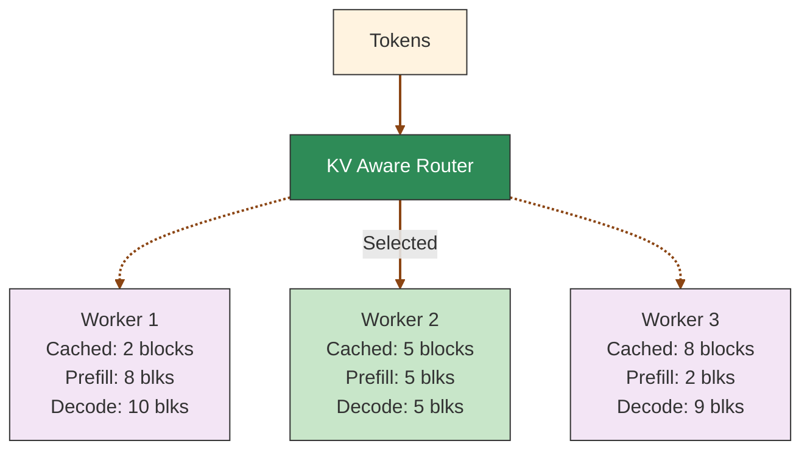
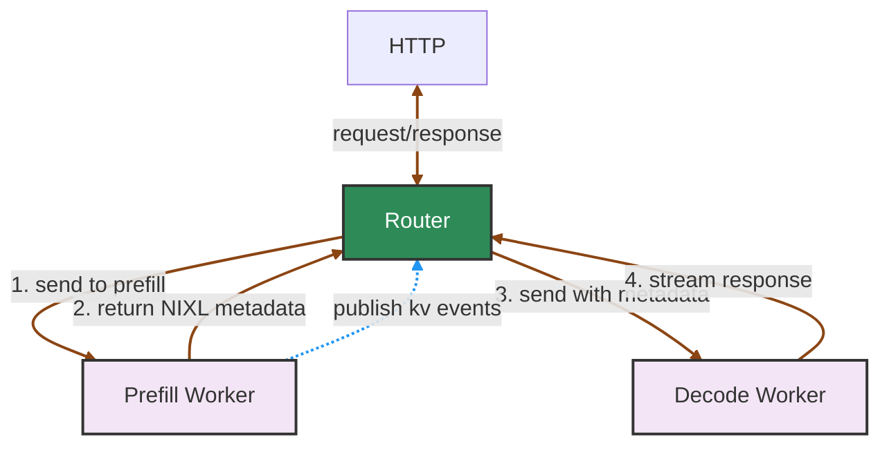

## Overview

The Dynamo KV Router intelligently routes requests by evaluating their computational costs across different workers. It considers both decoding costs (from active blocks) and prefill costs (from newly computed blocks), using KV cache overlap to minimize redundant computation. Optimizing the KV Router is critical for achieving maximum throughput and minimum latency in distributed inference setups.
This guide helps you get started with using the Dynamo router, with further details on configuration, disaggregated serving setup, and parameter tuning.

## Deployment Modes

The Dynamo router can be deployed in several configurations. The table below shows every combination and when to use it:

| Mode | Command | Routing Logic | KV Events | Topology | Use Case |
|------|---------|---------------|-----------|----------|----------|
| **Frontend + Round-Robin** | `python -m dynamo.frontend --router-mode round-robin` | Cycles through workers | None | Aggregated | Simplest baseline; no KV awareness |
| **Frontend + Random** | `python -m dynamo.frontend --router-mode random` | Random worker selection | None | Aggregated | Stateless load balancing |
| **Frontend + KV (Aggregated)** | `python -m dynamo.frontend --router-mode kv` | KV cache overlap + load | NATS Core / JetStream / ZMQ / Approx | Aggregated | Production single-pool serving with cache reuse |
| **Frontend + KV (Disaggregated)** | `python -m dynamo.frontend --router-mode kv` with prefill + decode workers | KV cache overlap + load | NATS Core / JetStream / ZMQ / Approx | Disaggregated (prefill + decode pools) | Separate prefill/decode for large-scale serving |
| **Frontend + Direct** | `python -m dynamo.frontend --router-mode direct` | Worker ID from request hints | None | Aggregated | External orchestrator (e.g., EPP/GAIE) selects workers |
| **Standalone Router** | `python -m dynamo.router` | KV cache overlap + load | NATS Core / JetStream / ZMQ | Any | Routing without the HTTP frontend (multi-tier, custom pipelines) |

### Routing Modes (`--router-mode`)

| Mode | Value | How Workers Are Selected |
|------|-------|-------------------------|
| **Round-Robin** | `round-robin` (default) | Cycles through available workers in order |
| **Random** | `random` | Selects a random worker for each request |
| **KV** | `kv` | Evaluates KV cache overlap and decode load per worker; picks lowest cost |
| **Direct** | `direct` | Reads the target `worker_id` from the request's routing hints; no selection logic |

### KV Event Transport Modes (within `--router-mode kv`)

When using KV routing, the router needs to know what each worker has cached. There are four ways to get this information:

| Event Mode | How to Enable | Description |
|------------|---------------|-------------|
| **NATS Core (local indexer)** | Default (no extra flags) | Workers maintain a local indexer; router queries workers on startup and receives events via NATS Core |
| **JetStream (durable)** | `--router-durable-kv-events` | Events persisted in NATS JetStream; supports snapshots and durable consumers. *Deprecated.* |
| **ZMQ** | `--event-plane zmq` | Workers publish via ZMQ PUB sockets; standalone indexer aggregates events |
| **Approximate (no events)** | `--no-router-kv-events` | No events consumed; router predicts cache state from its own routing decisions with TTL-based expiration |

### Aggregated vs. Disaggregated Topology

| Topology | Workers | How It Works |
|----------|---------|--------------|
| **Aggregated** | Single pool (prefill + decode in one process) | All workers handle the full request lifecycle |
| **Disaggregated** | Separate prefill and decode pools | Frontend routes to a prefill worker first, then to a decode worker; requires workers registered with `ModelType.Prefill` |

Disaggregated mode is activated automatically when prefill workers register alongside decode workers. See [Disaggregated Serving](#disaggregated-serving) for details.

### Frontend-Embedded vs. Standalone Router

| Deployment | Process | Metrics Port | Use Case |
|------------|---------|--------------|----------|
| **Frontend-embedded** | `python -m dynamo.frontend --router-mode kv` | Frontend HTTP port (default 8000) | Standard deployment; router runs inside the frontend process |
| **Standalone** | `python -m dynamo.router` | `DYN_SYSTEM_PORT` (if set) | Multi-tier architectures, SGLang disagg prefill routing, custom pipelines |

The standalone router does not include the HTTP frontend (no `/v1/chat/completions` endpoint). It exposes only the `RouterRequestMetrics` via the system status server. See the [Standalone Router README](https://github.com/ai-dynamo/dynamo/blob/main/components/src/dynamo/router/README.md).

## Quick Start

### Python / CLI Deployment

To launch the Dynamo frontend with the KV Router:

```bash
python -m dynamo.frontend --router-mode kv --http-port 8000
```

This command:
- Launches the Dynamo frontend service with KV routing enabled
- Exposes the service on port 8000 (configurable)
- Automatically handles all backend workers registered to the Dynamo endpoint

Backend workers register themselves using the `register_model` API, after which the KV Router automatically tracks worker state and makes routing decisions based on KV cache overlap.

#### CLI Arguments

| Argument | Default | Description |
|----------|---------|-------------|
| `--router-mode kv` | `round-robin` | Enable KV cache-aware routing |
| `--router-temperature <float>` | `0.0` | Controls routing randomness (0.0 = deterministic, higher = more random) |
| `--kv-cache-block-size <size>` | Backend-specific | KV cache block size (should match backend config) |
| `--router-kv-events` / `--no-router-kv-events` | `--router-kv-events` | Enable/disable real-time KV event tracking |
| `--router-kv-overlap-score-weight <float>` | `1.0` | Balance prefill vs decode optimization (higher = better TTFT) |
| `--router-queue-threshold <float>` | `2.0` | Queue threshold fraction; enables priority scheduling via `latency_sensitivity` |
| `--router-queue-policy <str>` | `fcfs` | Scheduling policy for the queue: `fcfs` (tail TTFT) or `wspt` (avg TTFT) |

For all available options: `python -m dynamo.frontend --help`

For detailed configuration options and tuning parameters, see [Advanced Router Usage](#advanced-router-usage).

### Kubernetes Deployment

To enable the KV Router in Kubernetes, add the `DYN_ROUTER_MODE` environment variable to your frontend service:

```yaml
apiVersion: nvidia.com/v1alpha1
kind: DynamoGraphDeployment
metadata:
  name: my-deployment
spec:
  services:
    Frontend:
      dynamoNamespace: my-namespace
      componentType: frontend
      replicas: 1
      envs:
        - name: DYN_ROUTER_MODE
          value: kv  # Enable KV Smart Router
```

**Key Points:**
- Set `DYN_ROUTER_MODE=kv` on the **Frontend** service only
- Workers automatically report KV cache events to the router
- No worker-side configuration changes needed

#### Environment Variables

All CLI arguments can be configured via environment variables using the `DYN_` prefix:

| CLI Argument | Environment Variable | Default |
|--------------|---------------------|---------|
| `--router-mode kv` | `DYN_ROUTER_MODE=kv` | `round-robin` |
| `--router-temperature` | `DYN_ROUTER_TEMPERATURE` | `0.0` |
| `--kv-cache-block-size` | `DYN_KV_CACHE_BLOCK_SIZE` | Backend-specific |
| `--no-router-kv-events` | `DYN_ROUTER_USE_KV_EVENTS=false` | `true` |
| `--router-kv-overlap-score-weight` | `DYN_ROUTER_KV_OVERLAP_SCORE_WEIGHT` | `1.0` |
| `--router-queue-policy` | `DYN_ROUTER_QUEUE_POLICY` | `fcfs` |

For complete K8s examples and advanced configuration, see [K8s Examples](router-examples.md#k8s-examples).
For A/B testing and advanced K8s setup, see the [KV Router A/B Benchmarking Guide](../../benchmarks/kv-router-ab-testing.md).

### Standalone Router

You can also run the KV router as a standalone service (without the Dynamo frontend) for disaggregated serving (e.g., routing to prefill workers), multi-tier architectures, or any scenario requiring intelligent KV cache-aware routing decisions. See the [Standalone Router component](https://github.com/ai-dynamo/dynamo/tree/main/components/src/dynamo/router/) for more details.

## KV Cache Routing

KV cache routing optimizes large language model inference by intelligently directing requests to workers with the most relevant cached data. By maximizing cache reuse, it reduces redundant computation and improves both throughput and latency.



KV Cache reuse introduces complexity to LLM serving load balancing. While it can significantly reduce computation costs, routing strategies that ignore worker-specific KV states can lead to:
- Missed cache reuse opportunities due to suboptimal worker selection
- System throughput degradation from uneven request distribution across workers

The router uses a cost function that considers both the prefill cost (influenced by cached blocks) and the decode load to make optimal routing decisions:

### Cost Calculation

1. **Prefill blocks**: Calculated by dividing the number of tokens requiring prefill processing by the block size. The system predicts this based on input tokens and available cached blocks per worker, updating the count when the first output token signals prefill completion.

2. **Decode blocks**: Estimated from the request's input tokens and each worker's active sequences. The count updates when requests complete and their blocks are freed.

3. **Cost formula**: `cost = overlap_score_weight * prefill_blocks + decode_blocks`
   - Lower costs indicate better routing choices
   - `overlap_score_weight` balances cache hit optimization against load distribution
   - Higher weights favor cache reuse (improving TTFT), while lower weights prioritize even load distribution (improving ITL)

### Worker Selection

The router selects the worker with the lowest cost. When `router_temperature` is set to a non-zero value, the router uses softmax sampling on the normalized cost logits to introduce randomness in the selection, which can help with load distribution.

Example calculation with `overlap_score_weight = 1.0`:
- Worker 1: cost = 1.0 * 8 + 10 = 18
- **Worker 2: cost = 1.0 * 5 + 5 = 10** (selected - lowest cost)
- Worker 3: cost = 1.0 * 2 + 9 = 11

### Using the KV Cache Router

To enable KV cache-aware routing, start the frontend node like this:
```bash
python -m dynamo.frontend --router-mode kv
```

When KV blocks are created or removed, the engine notifies the Dynamo router, which then identifies the worker with the best matching blocks and routes traffic accordingly.

To evaluate the benefits of KV-aware routing, compare your workload's performance using `--router-mode random|round-robin` against KV-aware routing.

For detailed CLI arguments and advanced configuration options, see [Advanced Router Usage](#advanced-router-usage).

### Basic Routing

Dynamo supports several routing strategies when sending requests from one component to another component's endpoint.

First, we must create a client tied to a components endpoint, we can do this using the labels defined above. Here we are getting a client tied to the `generate` endpoint of the `VllmWorker` component.

```python
client = runtime.endpoint("dynamo.VllmWorker.generate").client()
```

We can then use the default routing methods exposed by the client class to send requests to the `VllmWorker` component.

- **Random routing**: Default strategy, available via `client.generate()` or `client.random()`
- **Round-robin routing**: Cycles through available workers via `client.round_robin()`
- **Direct routing**: Explicitly targets a specific worker via `client.direct(input, component_id)`

KV Cache routing uses direct routing with a special worker selection algorithm.

For benchmarking KV router performance, see the [KV Router A/B Benchmarking Guide](../../benchmarks/kv-router-ab-testing.md).

For custom routing logic and advanced patterns, see [Routing Patterns](router-examples.md#routing-patterns) in the examples documentation.

## Advanced Router Usage

The main KV-aware routing arguments (frontend uses the same `--router-*` flag names as the standalone router; legacy names without the prefix are obsolete):

### Routing Behavior

- `--router-kv-overlap-score-weight`: Controls the importance of prefix cache overlaps in prefill cost calculations. Higher values improve Time To First Token (TTFT) at the cost of Inter-Token Latency (ITL). When set to 0, the router ignores prefix caches and uses pure load balancing. Defaults to 1.

- `--router-temperature`: Controls worker selection randomness through softmax sampling of router cost logits. A value of 0 (default) ensures deterministic selection of the lowest-cost worker, while higher values introduce more randomness.

- `--router-queue-threshold`: Queue threshold fraction for prefill token capacity (default: 2.0). The router holds incoming requests in a priority queue while all workers exceed this fraction of `max_num_batched_tokens`, releasing them when capacity frees up. This defers dispatch (not rejection) so that routing decisions use the most up-to-date load metrics at the moment the request is actually sent to a worker. It also enables **priority scheduling** via `latency_sensitivity` hints in `nvext.agent_hints` — higher values shift a request's effective arrival time earlier in the queue, giving it priority over lower-valued requests. Must be > 0. Set to None to disable queueing (requests are dispatched immediately).

- `--router-queue-policy`: Scheduling policy for the router queue (default: `fcfs`). Two policies are available:
  - **`fcfs`** (first-come first-served): Orders by adjusted arrival time (`priority_jump - arrival_offset`). Optimizes **tail TTFT** — no request waits longer than necessary.
  - **`wspt`** (weighted shortest processing time, Smith's rule): Orders by `(1 + priority_jump) / isl_tokens`. Optimizes **average TTFT** — short or high-priority requests are scheduled before long low-priority ones, minimizing total weighted completion time.

### KV Event Transport and Persistence

- `--no-router-kv-events`: Disables KV event tracking. By default (when this flag is not provided), the router uses KV events to monitor block creation and deletion from workers. When disabled with this flag, the router predicts cache state based on routing decisions with TTL-based expiration (default 120s) and pruning. Use this flag if your backend doesn't support KV events (or you are not confident in the accuracy or responsiveness of the events).

- `--router-durable-kv-events`: **(Deprecated — will be removed in a future release.)** Enables JetStream mode for KV event transport. The event-plane subscriber (local_indexer mode) is now the recommended path. When enabled, workers publish to JetStream instead of the local indexer, and the frontend consumes from JetStream as a durable consumer. Without this flag (default), workers use the local indexer with NATS Core or ZMQ event plane.

- `--router-reset-states`: Only applies in JetStream mode (`--router-durable-kv-events`). When specified, resets the router state on startup by clearing both the JetStream event stream and NATS object store, starting with a fresh state. **Warning**: Using `--router-reset-states` can bring existing router replicas into an inconsistent state. Only use this flag when launching the first router replica in a component, or consider using a different namespace/component for a clean slate.

- `--router-snapshot-threshold`: Only applies in JetStream mode (`--router-durable-kv-events`). Sets the number of messages in the JetStream before triggering a snapshot. When the message count exceeds this threshold, a router will attempt to purge acknowledged messages from the stream and create a snapshot of the current radix tree state in NATS object store. Defaults to 1000000. This helps manage stream size and provides faster initialization for routers that restart.

### Block Tracking

- `--no-router-track-active-blocks`: Disables tracking of active blocks (blocks being used for ongoing generation/decode phases). By default, the router tracks active blocks for load balancing. Disable this when routing to workers that only perform prefill (no decode phase), as tracking decode load is not relevant. This reduces router overhead and simplifies state management.

- `--router-track-output-blocks`: **(Experimental)** Enables tracking of output blocks during generation (default: disabled). When enabled, the router adds placeholder blocks as tokens are generated and applies fractional decay based on progress toward the expected output sequence length (`agent_hints.osl` in nvext). This improves load balancing accuracy for long-running generation requests by accounting for output-side KV cache growth.

- `--no-router-assume-kv-reuse`: When tracking active blocks, disables the assumption of KV cache reuse. By default (`router_assume_kv_reuse=true`), the router computes actual block hashes for sequence tracking to deduplicate blocks and optimize load balancing. When disabled via this flag, the router generates random hashes for sequence blocks, treating each request's blocks as unique. This is useful in disaggregated setups where prefill transfers blocks to decode workers that may already have those blocks cached, but the engine cannot coordinate transfers to avoid duplication. Without this flag, the router's load balancing heuristics would undercount decode blocks when duplicates exist.

- `--router-replica-sync`:  Disabled by default. Enables NATS-based synchronization of local routing decisions between router replicas. When enabled, routers share their active sequence information and local predictions of block usage, improving routing consistency across instances. Note that this does not sync the radix tree or cached KV block states themselves - in JetStream mode those are synchronized through JetStream events; in local indexer mode (default) each router queries workers directly.

### KV Indexer / Approx KV Indexer

- `--router-ttl-secs`: Time-to-live in seconds for blocks in the router's local cache predictions. Blocks older than this duration will be automatically expired and removed from the router's radix tree. Defaults to 120.0 seconds when `--no-router-kv-events` is used. This helps manage memory usage by removing stale cache predictions that are unlikely to be accurate.

- `--router-max-tree-size`: Maximum tree size (number of blocks) before pruning is triggered. When the total number of blocks in the radix tree exceeds this threshold, the router will prune the least recently used blocks. Defaults to 1048576 (2^20 blocks) when `--no-router-kv-events` is used. This prevents unbounded memory growth in long-running deployments.

- `--router-prune-target-ratio`: Target size ratio to prune down to when `--router-max-tree-size` is exceeded. For example, with a value of 0.8 (default) and max tree size of 1048576, the router will prune down to approximately 838860 blocks when the threshold is exceeded. Defaults to 0.8 when `--no-router-kv-events` is used. This creates headroom before the next pruning cycle.

- `--router-event-threads`: Number of event processing threads for the KV indexer (default: 4). When set to 1, the router uses a single-threaded radix tree with channel-based event processing. When set to a value greater than 1 (the default), the router uses a concurrent radix tree with a thread pool of the specified size for higher event throughput. This setting only applies when KV events are enabled (the default). When `--no-router-kv-events` is set (approximate mode), the router always uses a single-threaded indexer with TTL-based expiration and pruning regardless of this setting. This can be set via the `DYN_ROUTER_EVENT_THREADS` environment variable. For details on the underlying index data structures (`RadixTree`, `ConcurrentRadixTree`, `PositionalIndexer`) and their concurrency model (inline reads, sticky-routed writes via thread pool), see the [KV Router Index documentation](https://github.com/ai-dynamo/dynamo/blob/main/lib/kv-router/src/indexer/README.md).

To implement KV event publishing for custom inference engines, enabling them to participate in Dynamo's KV cache-aware routing, see [KV Event Publishing for Custom Engines](../../integrations/kv-events-custom-engines.md).

For details on per-request agent hints (`latency_sensitivity`, `osl`, `speculative_prefill`), see the [NVIDIA Request Extensions (`nvext`)](../frontend/nvext.md#agent-hints) documentation.

### Tuning Guidelines

The `--router-kv-overlap-score-weight` parameter is the primary knob for balancing prefill efficiency against decode load. Prefill-heavy workloads (long prompts, short generations) benefit from a higher weight, which steers requests toward workers with better cache overlap and reduces TTFT. Decode-heavy workloads (short prompts, long generations) benefit from a lower weight, which distributes decode load more evenly and reduces ITL. The default of 1.0 is a reasonable starting point; monitor TTFT and ITL metrics and adjust from there. This weight can also be overridden per request via `nvext.agent_hints.kv_overlap_score_weight`, which is useful when different request types in the same deployment have different latency profiles.

Use `--no-router-kv-events` when you are not confident that your backend engine emits KV events correctly — for example, with hybrid models or custom engines that haven't been validated for event accuracy. In this mode the router falls back to approximate routing, predicting cache state from its own routing decisions with TTL-based expiration and pruning, rather than relying on real-time block creation/deletion events from workers.

Use `--no-router-assume-kv-reuse` in disaggregated setups where the decode worker does not reuse transferred KV cache blocks. By default the router assumes KV blocks transferred from prefill to decode will be deduplicated on the decode side, but vLLM and SGLang decode workers currently do not support this — only TensorRT-LLM does. Without this flag, the router undercounts decode blocks when duplicates exist, leading to inaccurate load estimates.

Use `--router-track-output-blocks` **(experimental)** when your workload is output-heavy and you want the router to account for output-side KV cache growth in load balancing. This is useful in two scenarios: (1) workloads with long output sequences and little multi-turn reuse, where output blocks dominate the KV cache footprint; (2) agentic schedulers (e.g. NAT or other LLM routers) that can accurately predict the expected output sequence length per request. When enabled, the router adds placeholder blocks as tokens are generated. If you additionally pass `nvext.agent_hints.osl` (expected output sequence length in tokens) per request, the router applies fractional decay to output blocks — each output block's weight starts at 1.0 and decays linearly toward 0.0 as generation approaches the expected OSL. This lets the router predict that a request nearing completion will soon free its blocks, effectively modeling the future load trajectory rather than just the current snapshot. Without `osl`, output blocks are added at full weight with no decay. The flag requires `--router-track-active-blocks` (the default).

The `--router-queue-threshold` (default: 2.0) controls when incoming requests are held in a priority queue. The router holds requests while all workers exceed the given fraction of `max_num_batched_tokens`, releasing them as capacity frees up. This defers the routing decision so it is made with the freshest load metrics, rather than dispatching into an already-saturated system. It also enables priority scheduling via `nvext.agent_hints.latency_sensitivity`. Set to None to disable queueing entirely.

Use `--router-queue-policy wspt` when your workload has a mix of short and long requests and you want to minimize **average** TTFT. WSPT (Smith's rule) schedules short or high-priority requests first, reducing mean latency across the batch. Use the default `fcfs` when you want to minimize **tail** TTFT — no request waits longer than necessary, since ordering is purely by (adjusted) arrival time.

### Prometheus Metrics

The router exposes Prometheus metrics on the frontend's HTTP port (default 8000) at `/metrics`:

- **Router request metrics** (`dynamo_component_router_*`): Registered via the component's metrics hierarchy and exposed on the frontend via the `drt_metrics` bridge. In KV mode (aggregated and disaggregated) they are populated per-request; in non-KV modes (direct/random/round-robin) they are registered with zero values. The standalone router (`python -m dynamo.router`) also registers these metrics, available on `DYN_SYSTEM_PORT` when set.
- **Routing overhead metrics** (`dynamo_router_overhead_*`) and **per-worker gauges** (`dynamo_frontend_worker_*`): Registered on the frontend's own Prometheus registry. These are frontend-only and not available on the standalone router.

For the full list of router metrics, see the [Metrics reference](../../observability/metrics.md#router-metrics).

## Disaggregated Serving

Dynamo supports disaggregated serving where prefill (prompt processing) and decode (token generation) are handled by separate worker pools. When you register workers with `ModelType.Prefill` (see [Backend Guide](../../development/backend-guide.md)), the frontend automatically detects them and activates an internal prefill router.

### Automatic Prefill Router Activation

The prefill router is automatically created when:
1. A decode model is registered (e.g., via `register_model()` with `ModelType.Chat | ModelType.Completions`)
2. A prefill worker is detected with the same model name and `ModelType.Prefill`

**Key characteristics of the prefill router:**
- **Always disables active block tracking** (`track_active_blocks=false`) since prefill workers don't perform decode
- **Seamlessly integrated** into the request pipeline between preprocessing and decode routing
- **Falls back gracefully** to decode-only mode if prefill fails or no prefill workers are available

### Setup Example

When both workers are registered, requests are automatically routed.

```python
# Decode worker registration (in your decode worker)
decode_endpoint = runtime.endpoint("dynamo.decode.generate")

await register_model(
    model_input=ModelInput.Tokens,
    model_type=ModelType.Chat | ModelType.Completions,
    endpoint=decode_endpoint,
    model_name="meta-llama/Llama-2-7b-hf",
    # ... other parameters
)

await decode_endpoint.serve_endpoint(decode_handler.generate)

# Prefill worker registration (in your prefill worker)
prefill_endpoint = runtime.endpoint("dynamo.prefill.generate")

await register_model(
    model_input=ModelInput.Tokens,
    model_type=ModelType.Prefill,  # <-- Mark as prefill worker
    endpoint=prefill_endpoint,
    model_name="meta-llama/Llama-2-7b-hf",  # Must match decode model name
    # ... other parameters
)

await prefill_endpoint.serve_endpoint(prefill_handler.generate)
```

<Note>The unified frontend with automatic prefill routing is currently enabled for vLLM and TensorRT-LLM backends. For SGLang (work in progress), you need to launch a separate standalone router as the prefill router targeting the prefill endpoints. The standalone router (`python -m dynamo.router`) uses `--router-*`-prefixed flags (e.g., `--router-block-size`, `--router-kv-events`). See the [Standalone Router README](https://github.com/ai-dynamo/dynamo/blob/main/components/src/dynamo/router/README.md) and example script: [`examples/backends/sglang/launch/disagg_router.sh`](https://github.com/ai-dynamo/dynamo/blob/main/examples/backends/sglang/launch/disagg_router.sh).</Note>

### Request Flow

The following diagram shows an overview of the major components in disaggregated serving:



## Serving Multiple Router Replicas

For improved fault tolerance, you can launch multiple frontend + router replicas. If multiple `dynamo.frontend` processes share the same host or network namespace, give each instance a different HTTP port. In Kubernetes or on separate hosts, replicas can usually reuse the same container port. Alternatively, you can deploy the router separately as the standalone `python -m dynamo.router` service; see the [Standalone Router README](https://github.com/ai-dynamo/dynamo/blob/main/components/src/dynamo/router/README.md).

### Router State Management

The KV Router tracks two types of state (see [Router Design](../../design-docs/router-design.md) for details):

1. **Prefix blocks (cached KV blocks)**: Maintained in a radix tree, tracking which blocks are cached on each worker. This state is **persistent** - in local indexer mode (default) state is rebuilt from workers on startup; in JetStream mode (`--router-durable-kv-events`) it is backed by JetStream events and object store snapshots.

2. **Active blocks (decoding blocks)**: Tracks blocks currently being used for active generation requests. This state is **ephemeral** - when a new router replica starts, it begins with zero active block knowledge but becomes eventually consistent as it handles requests.

### Enabling Router Replica Synchronization

```bash
# Router replica 1
python -m dynamo.frontend --router-mode kv --http-port 8000 --router-replica-sync

# Router replica 2 (can be started later)
python -m dynamo.frontend --router-mode kv --http-port 8001 --router-replica-sync
```

The `--router-replica-sync` flag enables active block synchronization between replicas:
- Active blocks are shared via NATS core messaging (fire-and-forget)
- Replicas exchange routing decisions to maintain consistent load estimates
- A new replica starts with zero active blocks but quickly converges through request handling, by itself and active syncing with other replicas

Without this flag, each replica maintains its own isolated view of active blocks, potentially leading to suboptimal routing.

### Persistence and Recovery

Persistence behavior depends on which event transport mode is active:

**NATS Core / Event Plane with Local Indexer Mode (default):**
- State persists on workers—events are fire-and-forget but workers retain their local indexer state
- On startup, the router queries each worker's local indexer to rebuild state
- Recovery depends on workers being available; if a worker is down, its blocks cannot be recovered
- Simpler infrastructure (no JetStream required)
- For more info on how the local indexer handles gap detection and replay (and how it compares to vLLM's approach), see [KV Event Replay — Dynamo vs vLLM](kv-event-replay-comparison.md)

**JetStream Mode** (`--router-durable-kv-events` on **both** frontend **and** workers):
- Prefix blocks are stored in NATS JetStream with 1-hour retention
- Snapshots saved to NATS object store at configurable thresholds
- New replicas automatically restore this state on startup
- You can launch a third Router replica even if the first two are down, and it will recover the full prefix state

```bash
python -m dynamo.frontend --router-mode kv --http-port 8002 --router-replica-sync
```

<Note>

If you need to start with a fresh state in JetStream mode, you have two options:
1. **Recommended**: Use a different namespace/component (see [Distributed Runtime](../../design-docs/distributed-runtime.md)) which will start a new stream and NATS object store path
2. **Use with caution**: Launch a router with the `--router-reset-states` flag, which will purge the entire stream and radix snapshot. This should only be done when launching the first router replica in a component, as it can bring existing router replicas into an inconsistent state.

</Note>

## Additional Notes

**State persistence** depends on the event transport mode:
- **NATS Core / Event Plane mode** (default): State persists on workers—router rebuilds state by querying workers on startup. This is the default when workers have `local_indexer` enabled (which is the default). Works with both NATS Core and ZMQ event planes.
- **JetStream mode** (`--router-durable-kv-events` on **both** frontend **and** workers): State persists across router restarts via JetStream and NATS object store snapshots.
- **No KV events** (`--no-router-kv-events`): State persistence is not supported.

**Request plane is independent of KV event transport.**
The request plane (`DYN_REQUEST_PLANE` / `--request-plane`) controls how requests reach workers (TCP/HTTP/NATS), while KV events travel over a separate path. KV events use NATS in JetStream or NATS Core modes, or ZMQ when `--event-plane zmq` is set. With `--event-plane zmq` and `--discovery-backend file` or `mem`, the router can run entirely without etcd or NATS. When using a NATS-based event plane (the default), NATS is initialized automatically; set `NATS_SERVER=nats://...` to override the default `localhost:4222`. Use `--no-router-kv-events` to disable KV event transport entirely.

When `--router-kv-overlap-score-weight` is set to 0, no KVIndexer is created and prefix matching is disabled (pure load balancing). When `--no-router-kv-events` is set, a KVIndexer is still created but no event subscriber is launched to consume KV events from workers. Instead, the router predicts cache state based on its own routing decisions with TTL-based expiration and pruning.

**Backend KV event publishing** is independent of the frontend's `--no-router-kv-events` flag. The frontend flag controls whether the router *consumes* events; the backend flags control whether workers *publish* them. If the router is not consuming events, workers that still publish will waste resources but cause no harm. By default, SGLang and TRT-LLM do not publish KV events. vLLM auto-enables publishing when prefix caching is active (deprecated — will default to off in a future release). To explicitly control publishing:
- **vLLM**: Pass `--kv-events-config '{"enable_kv_cache_events": false}'` to disable, or `'{"enable_kv_cache_events": true, "publisher": "zmq", "endpoint": "tcp://*:5557"}'` to enable.
- **SGLang**: Pass `--kv-events-config` with a JSON config to enable; omit to keep disabled.
- **TRT-LLM**: Pass `--publish-events-and-metrics` to enable; omit to keep disabled.

The cli args `--router-ttl-secs`, `--router-max-tree-size`, and `--router-prune-target-ratio` control local cache management when the router operates without receiving events from workers. When workers are configured to publish KV events (via `--kv-events-config`), the router relies on worker-side eviction events and these parameters are ignored.

**Queue threshold vs. busy rejection thresholds:** `--router-queue-threshold` and the busy thresholds (`--active-decode-blocks-threshold`, `--active-prefill-tokens-threshold`, `--active-prefill-tokens-threshold-frac`) serve different purposes. The busy thresholds **reject** a worker entirely from the candidate set when it exceeds a utilization limit — no traffic is sent until it drops below the threshold. In contrast, `--router-queue-threshold` does not reject workers; it **defers the entire routing decision** until at least one worker has capacity, so the request is routed with the freshest load metrics. The queue also enables priority scheduling via `nvext.agent_hints.latency_sensitivity`. The busy thresholds can be updated at runtime without restarting the frontend via the `/busy_threshold` HTTP endpoint. For details on busy detection, threshold tuning, and the runtime API, see [Request Rejection](../../fault-tolerance/request-rejection.md).

## See Also

- **[Router README](README.md)**: Quick start guide for the KV Router
- **[Router Examples](router-examples.md)**: Python API usage, K8s examples, and custom routing patterns
- **[KV Router Index Data Structures](https://github.com/ai-dynamo/dynamo/blob/main/lib/kv-router/src/indexer/README.md)**: `RadixTree`, `ConcurrentRadixTree`, and `PositionalIndexer` internals and concurrency model
- **[KV Event Replay — Dynamo vs vLLM](kv-event-replay-comparison.md)**: How Dynamo's local indexer compares to vLLM's replay buffer for gap detection and recovery
- **[Router Design](../../design-docs/router-design.md)**: Architecture details and event transport modes
- **[KV Event Publishing for Custom Engines](../../integrations/kv-events-custom-engines.md)**: Integrate custom inference engines with KV-aware routing
- **[Prometheus and Grafana Setup](../../observability/prometheus-grafana.md)**: General Prometheus/Grafana configuration
- **[Metrics Developer Guide](../../observability/metrics-developer-guide.md)**: How the Dynamo metrics API works
