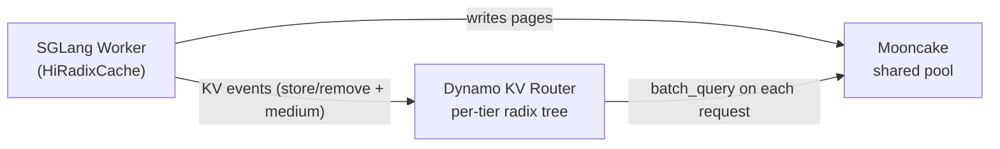

This guide covers running SGLang's Hierarchical Cache (HiCache) with Dynamo, and how the Dynamo KV router integrates with HiCache for tier-aware worker selection when workers share an external pool such as Mooncake.

## Overview

SGLang HiCache extends RadixAttention with a multi-tier KV cache that transparently moves pages between GPU HBM, host memory, and an optional external storage backend (e.g. Mooncake). For a full description of HiCache itself — flag reference, storage backends, memory layouts, prefetch policies — see SGLang's own documentation:

- [SGLang HiCache Design](https://docs.sglang.ai/advanced_features/hicache_design.html)
- [SGLang HiCache Best Practices](https://docs.sglang.ai/advanced_features/hicache_best_practices.html)

What Dynamo adds on top of HiCache:

- **Tier-aware routing.** The KV router tracks which cache tier each block lives on (GPU / Host / External) and uses that when scoring candidate workers — not just device overlap.
- **Shared-pool awareness.** When an external backend such as Mooncake is configured, the router queries the shared pool in parallel with its own indexer so it can discount prefill cost for blocks any worker can fetch, not just blocks the candidate holds locally.

If you are running a single worker with HiCache and no shared pool, no Dynamo-side configuration is required — the worker reports KV events to the router as usual.

## Running SGLang with HiCache

Launch a worker with HiCache enabled:

```bash
python -m dynamo.sglang \
  --model-path Qwen/Qwen3-0.6B \
  --page-size 64 \
  --enable-hierarchical-cache \
  --hicache-ratio 2 \
  --hicache-write-policy write_through \
  --hicache-storage-backend nixl \
  --skip-tokenizer-init
```

Then start the frontend:

```bash
python -m dynamo.frontend --http-port 8000
```

<Note>
The HiCache flags (`--enable-hierarchical-cache`, `--hicache-ratio`, `--hicache-write-policy`, `--hicache-storage-backend`, `--hicache-mem-layout`, etc.) are SGLang-native — Dynamo passes them through unchanged. See [SGLang's best-practices doc](https://docs.sglang.ai/advanced_features/hicache_best_practices.html) for the complete flag reference and tuning guidance.
</Note>

## Tier-Aware Shared KV Cache Routing

When you scale out to multiple SGLang workers that share an external pool such as [Mooncake](https://github.com/kvcache-ai/Mooncake), the Dynamo router can be made tier-aware. It tracks per-tier residency from worker events and consults the shared pool directly so that blocks cached anywhere in the cluster — not just on the candidate worker's GPU — contribute to worker scoring.

### Why

By default the router's radix tree only reflects blocks resident in **GPU HBM** on each worker. HiCache silently demotes blocks to host memory and further to Mooncake as the device pool fills, but the router never sees those transitions. A worker that has the full request prefix on host + Mooncake looks identical to a cold worker. The router ends up treating "fetchable from Mooncake in milliseconds" the same as "must be recomputed from scratch."

### Event model

SGLang's `HiRadixCache` emits `BlockStored` / `BlockRemoved` events carrying a `medium` field on every tier transition:

| Transition                                        | Event emitted    |
| ------------------------------------------------- | ---------------- |
| Fresh prefill writes blocks to GPU                | `store(GPU)`     |
| GPU → Host copy (after async DMA completes)       | `store(CPU)`     |
| GPU evicted, block still resident on Host         | `remove(GPU)`    |
| Host evicted (block gone from all worker tiers)   | `remove(CPU)`    |
| Host → GPU promotion (`load_back`)                | `store(GPU)`     |
| External → Host prefetch (L2 materialization)     | `store(CPU)`     |

A few properties the router relies on:

- **Ordering.** `store(new_tier)` is emitted before `remove(old_tier)` so the block is never invisible to the router during a transition.
- **DMA safety.** `store(CPU)` for a GPU→Host copy is deferred until `finish_event.synchronize()` confirms the DMA landed — events never fire before bytes are resident.
- **Per-tier tracking.** A block can be on GPU and Host simultaneously. The router records both and picks the highest-priority tier when scoring overlap.

### How it works



On every request the router runs two lookups in parallel:

- Its own radix tree, built from worker KV events (per-tier).
- A batch query to the Mooncake master for blocks reachable from the shared pool.

If the shared-pool query fails, the router falls back to indexer-only scoring and logs a warning. The request still succeeds.

### Scoring

For each candidate worker, the router computes a **logit** (lower wins):

```text
# Without shared cache
logit = overlap_weight * (prefill_tokens / block_size) + decode_blocks

# With shared cache
shared_beyond    = shared_cache_hits.hits_beyond(worker_device_overlap)
reduction        = shared_cache_multiplier * shared_beyond * block_size
adjusted_prefill = max(0, prefill_tokens - reduction)
logit            = overlap_weight * (adjusted_prefill / block_size) + decode_blocks
```

`hits_beyond(n)` counts shared-cache pages at positions `>= n` — "pages past my device prefix that I can still fetch from Mooncake instead of recomputing."

**Worked example.** Request is 4 blocks, `shared_cache_multiplier = 0.5`, `block_size = 1`, `overlap_weight = 1.0`. Shared pool contains blocks 0–3.

| Worker | Device overlap | `hits_beyond` | Reduction | Adjusted prefill | Logit          |
| ------ | -------------- | ------------- | --------- | ---------------- | -------------- |
| W0     | 2 (A, B)       | 2 (C, D)      | 1.0       | 3.0              | 3.0            |
| W1     | 0              | 4 (A, B, C, D)| 2.0       | 2.0              | **2.0 — wins** |

W1 wins despite zero local overlap, because the shared pool covers its whole prefix. The multiplier encodes the cost ratio of a Mooncake fetch relative to a fresh GPU compute — `0.5` means "fetching from shared is half as expensive as recomputing."

## Requirements

<Info>
Tier-aware shared cache routing requires SGLang changes from [sgl-project/sglang#22894](https://github.com/sgl-project/sglang/pull/22894) ("fix(hicache): emit KV events for L2 host cache insertions"). This PR is **not yet merged** to SGLang main. Until it lands and a SGLang release includes it, the feature is not accessible from a stock `pip install sglang` — you must build SGLang from the PR branch (`gh pr checkout 22894 && pip install -e python/` from the SGLang repo). This section will be updated with the minimum required version once #22894 ships in a release.
</Info>

Without PR #22894, worker events carry only `medium=GPU` and the router is blind to Host-tier residency — regardless of Mooncake configuration.

You also need:

- Dynamo router started with `--shared-cache-type hicache` (see [Configuration](#configuration)).
- A Mooncake master reachable from the Dynamo frontend host. Worker-side Mooncake config (master address, page size, TP/PP layout, split-head layout) is published automatically via each worker's registration metadata when the worker is started with `--hicache-storage-backend mooncake`.

## Setup

**SGLang worker** — HiCache with Mooncake storage:

```bash
python -m dynamo.sglang \
  --model-path Qwen/Qwen3-0.6B \
  --page-size 64 \
  --enable-hierarchical-cache \
  --hicache-ratio 2 \
  --hicache-write-policy write_through \
  --hicache-storage-backend mooncake \
  --hicache-storage-backend-extra-config '{"master_server_address": "mooncake-master.internal:50051"}' \
  --skip-tokenizer-init
```

Launch additional workers on other GPUs / hosts with the same Mooncake config so they back to the same cluster.

**Dynamo frontend** — enable tier-aware routing:

```bash
python -m dynamo.frontend \
  --http-port 8000 \
  --router-mode kv \
  --shared-cache-type hicache \
  --shared-cache-multiplier 0.5
```

## Configuration

| Flag                        | Env var                       | Default | Description                                                                                                                                                       |
| --------------------------- | ----------------------------- | ------- | ----------------------------------------------------------------------------------------------------------------------------------------------------------------- |
| `--shared-cache-type`       | `DYN_SHARED_CACHE_TYPE`       | `none`  | `none` disables shared-pool lookups; `hicache` enables Mooncake queries.                                                                                          |
| `--shared-cache-multiplier` | `DYN_SHARED_CACHE_MULTIPLIER` | `0.0`   | Discount factor for shared-pool hits. `0.0` queries but ignores them; `0.5` treats a shared hit as half a device hit; `1.0` treats shared and device hits equally. |

Per-request overrides are available via `RouterConfigOverride.shared_cache_multiplier` for A/B experimentation without restarting the router.

No extra flags are required on the worker. When `--hicache-storage-backend mooncake` is set, Dynamo publishes the required metadata (page size, TP/PP layout, master address) via the worker's `ModelRuntimeConfig.engine_specific` blob under the key `sglang_hicache_mooncake`.

## Verification

**Events carry a medium.** Run the worker with `--log-level debug` and grep the log:

```bash
python -m dynamo.sglang ... --log-level debug 2>&1 | grep -E 'BlockStored|BlockRemoved'
# BlockStored(block_hashes=[...], medium=CPU_PINNED)
# BlockRemoved(block_hashes=[...], medium=GPU)
```

If `medium` is missing or always reads `GPU`, the worker is running an SGLang build without PR #22894.

**Router sees the shared pool.** Two new histograms are exposed on the frontend's Prometheus endpoint:

| Metric                              | Meaning                                                                 |
| ----------------------------------- | ----------------------------------------------------------------------- |
| `router_shared_cache_hit_rate`      | Fraction of request blocks found in the shared pool (0.0–1.0).          |
| `router_shared_cache_beyond_blocks` | Blocks in the shared pool *beyond* the selected worker's device overlap. |

```bash
curl -s localhost:8000/metrics | grep shared_cache
```

## Troubleshooting

| Symptom                                                  | Likely cause                                                          | Fix                                                                                           |
| -------------------------------------------------------- | --------------------------------------------------------------------- | --------------------------------------------------------------------------------------------- |
| `shared_cache_hit_rate` is always 0                      | Mooncake master unreachable from the router host                      | Check network path; the router logs `Shared cache query failed` when it can't reach Mooncake. |
| Events only ever carry `medium=GPU`                      | SGLang missing [PR #22894](https://github.com/sgl-project/sglang/pull/22894) | Rebuild SGLang from the PR branch.                                                      |
| Workers registered but router never queries shared cache | `--shared-cache-type` left at default `none`                          | Set `--shared-cache-type hicache` on the frontend.                                            |
| Queries issued but winning worker rarely changes         | `--shared-cache-multiplier 0.0`                                       | Raise the multiplier — typical starting range is `0.3`–`0.7`.                                 |
| Page-size mismatch warnings                              | Router `--page-size` doesn't match worker `--page-size`               | They must agree; the router hashes pages using the worker's page size.                        |
| Router logs "no workers have HiCache enabled"            | No worker published `sglang_hicache_mooncake` metadata                | Confirm workers started with `--hicache-storage-backend mooncake`.                            |

## Further Reading

- [SGLang HiCache Design](https://docs.sglang.ai/advanced_features/hicache_design.html) and [Best Practices](https://docs.sglang.ai/advanced_features/hicache_best_practices.html)
- [Mooncake](https://github.com/kvcache-ai/Mooncake) — the shared KV store used as the external tier
- [SGLang PR #22894](https://github.com/sgl-project/sglang/pull/22894) — the tier-annotated events prerequisite
- [KVBM Guide](../../components/kvbm/kvbm-guide.md) — Dynamo's own block manager, an alternative to HiCache
- [KV Events for Custom Engines](../../integrations/kv-events-custom-engines.md) — the event protocol contract for backends other than SGLang
