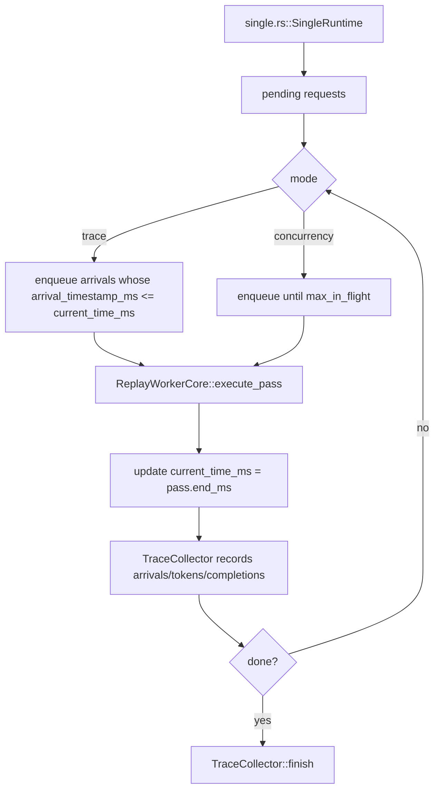
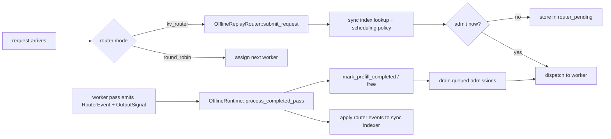

# Offline Replay Harness

This directory contains the in-process offline replay harness used by `dynamo_mocker::replay`.

The goal is to simulate trace execution without spinning up async runtimes, network planes, or real worker tasks. Instead, the harness advances a logical clock, steps mock engine cores directly, and records request/token timing into `TraceCollector` in `lib/mocker/src/replay/collector.rs`.

## Where It Sits

The public replay entrypoints live one level up in `lib/mocker/src/replay/entrypoints.rs`. They:

- normalize `MockEngineArgs`
- load or accept `DirectRequest`s or `loadgen::Trace` workloads
- validate replay arguments
- dispatch to offline or online replay

Offline replay starts in `lib/mocker/src/replay/offline/mod.rs`.

`offline/mod.rs` chooses between three implementations:

- `lib/mocker/src/replay/offline/single.rs` for the special case `num_workers == 1` with the vLLM engine
- `lib/mocker/src/replay/offline/multi.rs` for everything else, including multi-worker replay and `kv_router` replay
- `lib/mocker/src/replay/offline/disagg.rs` for offline disaggregated prefill/decode replay

## File Map

- `lib/mocker/src/replay/offline/mod.rs`
  Chooses single-worker fast path vs multi-worker harness.
- `lib/mocker/src/replay/offline/single.rs`
  Minimal replay loop for one vLLM worker.
- `lib/mocker/src/replay/offline/multi.rs`
  General offline cluster simulator for multi-worker replay and KV-router replay.
- `lib/mocker/src/replay/offline/disagg.rs`
  Offline two-stage replay harness with separate prefill and decode pools.
- `lib/mocker/src/replay/offline/state.rs`
  Per-worker wrapper around `EngineCore`, including optional KV event capture.
- `lib/mocker/src/replay/offline/events.rs`
  Priority-queue event type used by the multi-worker harness.
- `lib/mocker/src/replay/offline/core.rs`
  Small `ReplayWorkerCore` wrapper used by the single-worker path.

## Single-Worker Fast Path

The single-worker path is intentionally simple and only used when:

- `num_workers == 1`
- engine type is `vllm`

That path avoids the cluster event queue and router machinery entirely, but it now supports both:

- flat request replay
- workload-driven replay through `WorkloadDriver` for multi-turn/session traces

Important details:

- Trace mode uses `normalize_trace_requests` in `lib/mocker/src/replay/mod.rs` so the first request starts at `0 ms`, then applies `arrival_speedup_ratio`.
- Concurrency mode ignores original arrival spacing and keeps the worker filled up to `max_in_flight`.
- Workload trace mode honors first-turn timestamps and inter-turn delays.
- Workload concurrency mode ignores first-turn timestamps but still enforces inter-turn delays after completion.
- The worker itself is still the real mocker engine core; only the scheduling loop is simplified.

## Multi-Worker Harness

The general harness lives in `lib/mocker/src/replay/offline/multi.rs`. It models a cluster with:

- a logical clock `now_ms`
- a pending request queue
- one [`OfflineWorkerState`](/Users/peabrane/Documents/codes/dynamo/lib/mocker/src/replay/offline/state.rs) per worker
- a binary heap of future completion events
- an optional synchronous offline router

### Main Loop

The harness is event-driven. It does not sleep. Instead, `OfflineRuntime` repeatedly:

1. picks the next meaningful timestamp
2. advances `now_ms`
3. applies any worker completion events scheduled for that time
4. admits newly available requests, either from trace arrivals or concurrency backfill
5. starts passes on workers that are ready to run
6. pushes new `WorkerCompletion` events back into the binary heap

It only advances `now_ms` to the next meaningful timestamp:

- next request arrival
- next worker completion event

### Worker Model

Each worker is represented by `OfflineWorkerState` in `lib/mocker/src/replay/offline/state.rs`:

- wraps an `EngineCore`
- tracks whether a pass is currently in progress
- tracks in-flight request count separately from engine internals
- optionally enables KV event capture when replay is running with `kv_router` mode

The pass execution itself still comes from the real scheduler core:

- `VllmCore::execute_pass(...)`
- `SglangCore::execute_pass(...)`

So offline replay is not a toy simulator. It reuses the real per-pass mocker scheduling logic, but drives it deterministically.

## Completion Event Queue

The multi-worker and disagg harnesses use `SimulationEvent` from `lib/mocker/src/replay/offline/events.rs` as a min-time priority queue implemented with `BinaryHeap`.

Right now the only scheduled event type is:

- `WorkerCompletion`

That event carries:

- worker `stage` (`aggregated`, `prefill`, or `decode`)
- `worker_idx`
- `completed_requests`
- `output_signals`
- router-visible `kv_events`

Those are emitted after a worker pass is executed and then applied later when the harness clock reaches `pass.end_ms`.

## Router Integration

Offline replay can run in:

- `round_robin`
- `kv_router`

The router implementation for offline mode lives in `lib/mocker/src/replay/router/offline.rs`.

This router is synchronous and in-process:

- no async worker tasks
- no event plane
- no background indexer thread

Instead it maintains:

- a local radix tree indexer
- local `ActiveSequencesMultiWorker` state
- a pending queue for queued requests

### Why KV events are captured only where needed

When offline replay uses `kv_router`, workers are created with KV event capture enabled via:

- `VllmCore::new_with_kv_capture` in `lib/mocker/src/scheduler/vllm/core.rs`
- `SglangCore::new_with_kv_capture` in `lib/mocker/src/scheduler/sglang/core.rs`

That causes each pass to return router-visible `kv_events`, which the harness applies synchronously to the offline router indexer after the pass completes.

In round-robin mode, this capture is skipped because nothing consumes those events.
In offline disagg replay, only the prefill workers capture and publish KV events; the decode workers
run with capture disabled because the decode router is overlap-blind and does not consume router
events.

## Disaggregated Harness

The disaggregated runtime in `lib/mocker/src/replay/offline/disagg.rs` models two distinct stages:

- a prefill router and prefill worker pool
- a decode router and decode worker pool

It keeps one logical clock and one completion-event heap, but request ownership moves through a
two-stage state machine instead of the aggregated single-pool lifecycle.

The prefill router is derived from the main router config with `router_track_active_blocks = false`.
The decode router is derived with:

- overlap disabled
- `assume_kv_reuse = false`
- `track_prefill_tokens = false`

The prefill stage runs a hidden synthetic one-token bootstrap request. When prefill completes, the
harness:

1. applies any prefill KV events
2. marks prefill complete in the prefill router
3. frees prefill router state
4. enqueues the original request into decode at the same logical timestamp

Decode then runs with normal collector visibility. The public replay report remains decode-only, so
TTFT includes prefill queueing and prefill compute.

## Trace vs Concurrency Modes

Both single and multi harnesses support two admission modes:

- Trace mode
  - for flat requests, respects input arrival timestamps
  - for workloads, respects first-turn timestamps and inter-turn delays
  - timestamps are normalized so the first request or first session starts at `0 ms`
  - `arrival_speedup_ratio` compresses or stretches inter-arrival gaps and inter-turn delays

- Concurrency mode
  - ignores original first-turn spacing
  - keeps up to `max_in_flight` requests resident in the cluster
  - for workloads, still unlocks follow-up turns only after completion plus inter-turn delay
  - stamps synthetic arrival times as requests are admitted

This split is why `lib/mocker/src/replay/offline/mod.rs` exposes both:

- `simulate_trace(...)`
- `simulate_concurrency(...)`

## Metrics Collection

Both harnesses emit request timing into `TraceCollector` in `lib/mocker/src/replay/collector.rs`:

- arrival
- admission
- token emission
- completion

The harness itself does not compute final throughput/latency metrics incrementally. It records events, then `TraceCollector::finish()` derives the final `TraceSimulationReport` from `lib/mocker/src/replay/collector.rs`.

## Mental Model

The easiest way to think about offline replay is:

1. Reuse the real mocker scheduling pass logic.
2. Replace wall-clock async execution with a deterministic logical clock.
3. Optionally replace networked router behavior with a synchronous in-process router model.
4. Record the same request lifecycle timings into `TraceCollector`.

That keeps the harness fast, reproducible, and close to the real scheduler behavior without needing to boot a live runtime.
